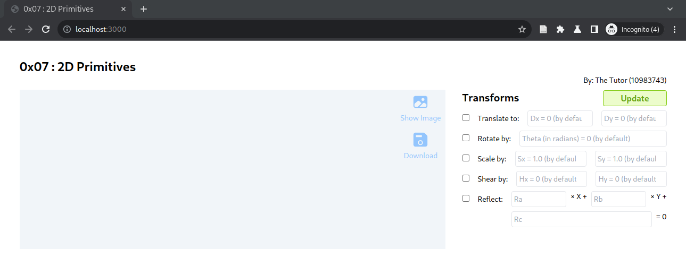

# 0x07 : 2D Primitives #

[Starter
Template](https://github.com/tiet-ucs505/0x07-2d-primitives)
| [Submission Form](https://docs.google.com/forms/d/e/1FAIpQLSdmWJoYQzw2B_xgiqTSuYdEumigXqnRTr8fCIaA9ptPvf_KTQ/viewform?usp=pp_url&entry.1189318782=3CO6&entry.294246879=10210000&entry.117129202=Shakti+Mann&entry.1197422271=https://github.com/shaktimann000/)

|                       |                          |
|-----------------------|--------------------------|
| Submission Code       | 0x07                     |
| Submission Form Opens | Wed 3 Apr 2024 17:00 hrs |
| Deadline              | Mon 8 Apr 2024 08:00 hrs |
| Weightage             | 3 marks                  |

## Assignment ##

1. **Choose a shape** to draw, and save its reference
   image as
   `./assets/<roll-no>-0x07-2d-primitives-refimg.png`.
   Remember to replace `<roll-no>`.  It should reflect
   in the `index.html` upon clicking "Show image."
   Also upload it to the form along with your
   submission.  Here's a reference on [how to choose a
   shape](./suggestions.md#how-to-choose-a-shape), for
   anyone interested.
2. **Draw the shape**.  Use [canvas draw
   functions](./quick-reference.md#geometry-definition)
   to create the shape so as to redefine and complete
   the function
   [`Experiment.createGeometry`](./experiment.js#L56).
3. **Transform**.  Refactor the function
   [`Experiment.getBaseTransform`](./experiment.js#L86)
   to generate a suitable initial state for the shape.
   Also see [the suggestions for its
   implementation](./suggestions.md#how-to-implement-transforms),
   [useful
   API](./quick-reference.md#dommatrix-interface) and
   [its math](./transformation-math.md).
4. **Stylise**.  Refactor the function
   [`Experiment.getBaseStyles`](./experiment.js#L104)
   to generate a soothing style. Here's a quick
   reference on [rendering and stylisation using HTML
   Canvas](./quick-reference.md#rendering-canvas-in-2d).
5. **UI**. Refactor the function
   [`Experiment.handleTransforms`](./experiment.js#L45)
   to handle the inputs from UI.
6. **Collage**.  Snapshot a few of your canvases using
   Download button; and compile a collage using the
   same.  Rename the collage as follows and upload it
   to the form along with your submission.  
   `<roll-no>-0x07-2d-primitives-collage.png`

## Submit ##

1. Git URL
2. Commit ID
3. Reference Image (of the shape chosen in Step 1)
4. Teaser (from Collage in Step 6)

### Evaluation Criteria ###

+ *1 mark*: Clarity on what is a good shape to start
  with and creativity of composition; based on
  `refimg` + `collage`;
+ *1 mark*: Implementation of Render Engine;
+ *1 mark*: UI gluing.

## Candidate's Remarks ##

*[Statements within braces [] are comments,
placeholders and directive. Please remove them and /or
replace them with your response.]*

*[Q: Apart from the given objective, what did you try
to/ were able to achieve through this assignment.]*

*[Q: How difficult/ easy did you find doing this?
Reference it with the fact that you are supposed to
spend 3-4 hours on this problem.  1 hr in the Lab and
rest later.]*

*[Q: Do you think this exercise may help you solve a
real world problem that you may encounter? Please quote
an example if so.]*

## Acknowledgements ##

*[Are there any external resources, friends,
colleagues, mentors who have helped you do it. Please
acnowledge them.]*

## Objective ##

+ Use
  [`Path2D`](https://developer.mozilla.org/en-US/docs/Web/API/Path2D)
  to define primitives.
+ Define geometric transforms and apply using
  [`addPath`
  interface](https://developer.mozilla.org/en-US/docs/Web/API/Path2D/addPath),
  including
  + Rigid-body tranforms
  + Reflection
  + Shear
+ Rendering the canvas, *e.g.*
  + [Stroke
    outline](https://developer.mozilla.org/en-US/docs/Web/API/CanvasRenderingContext2D/stroke)
    with [Line
    type](https://developer.mozilla.org/en-US/docs/Web/API/CanvasRenderingContext2D/setLineDash),
    [Line
    width](https://developer.mozilla.org/en-US/docs/Web/API/CanvasRenderingContext2D/lineWidth),
    and
    [Color/Gradient/Pattern](https://developer.mozilla.org/en-US/docs/Web/API/CanvasRenderingContext2D/strokeStyle)
  + [Fill
    Region](https://developer.mozilla.org/en-US/docs/Web/API/CanvasRenderingContext2D/fill)
    with
    [Color/Gradient/Pattern](https://developer.mozilla.org/en-US/docs/Web/API/CanvasRenderingContext2D/fillStyle)

