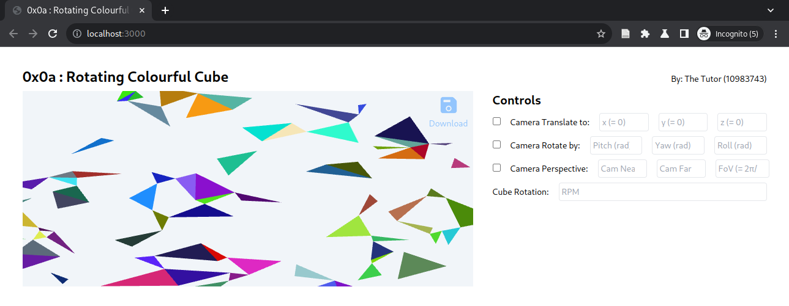

# 0x0a : Rotating Colourful Cube #
[Stater Template](https://github.com/tiet-ucs505/0x0a-rotating-colourful-cube)
| [Submission Form](https://docs.google.com/forms/d/e/1FAIpQLScBTZfmCkCzzmxTJflvpqvf628hT3GuNwgTAytvYyUImJc-cQ/viewform?usp=pp_url&entry.1189318782=3CO6&entry.294246879=10210000&entry.117129202=Shakti+Mann&entry.1197422271=https://github.com/shaktimann000/0x0a)

|                  |                              |
|------------------|------------------------------|
| Code             | 0x0a                         |
| Submission Opens | Wed 24 Apr 2024 17:00 hrs    |
| Deadline         | Mon 29 Apr 2024 08:00 hrs    |
| Weightage        | 2 marks                      |

## Assignment ##
Update the candidate details in [`main.js`](./main.js)

### Step 1. Handle the camera controls ###

The boilerplate renders random rectangles on plane
$Z=0$.

The task is 
+ To modify the [`vertex.glsl`](./vertex.glsl) and
  [`fragment.glsl`](./fragment.glsl); to account for
  Model-View and Projection Transformations to the
  geometry;
+ Refactor the functions (if required)
  [`RefTriangles2.setupShaders`](./ref-triangles-2/index.js#L42-L97)
  and
  [`RefTriangles2.setupVao`](./ref-triangles-2/index.js#L116-L181),
  accordingly;
+ Compute the transformation matrices based on inputs
  and set values at relevant pointers within the
  program in
  [`RefTriangles2.draw`](./ref-triangles-2/index.js#L206-L224)

### Step 2. Render a Cube ###
+ Refactor function [`generateData(N,
  redundancy=6)`](./experiment.js#L64-71) to return
  `pos` and `colors` values corresponding to a cube

### Step 3. Handle the Cube Rotation RPM ###
+ Refactor
  [`RefTriangles2.draw`](./ref-triangles-2/index.js#L206-L224)
  to account for cube rotation, based on `ms`.
+ Calibrate for `inputs.cubeRpm`.

## Submit ##

1. Git URL
2. Commit ID
3. Teaser: `<roll-no>-<problem-code>-<desc>-teaser.png`
4. Video Link

## Evaluation Criteria: ##

+ *1 mark*: Handling the camera controls;
+ *1 mark*: Handling the Cube Rotation RPM.

## Objective ##

Recall the [003-gl
exercise](https://github.com/tiet-ucs505/003-gl) to
draw points, lines and triads with WebGL.

The objective is to 
+ Create a canonical cube of side length 2 units placed
  at (-1,-1,-1);
+ Looked at towards its center from a given position,
  so that the up-vector always pointing towards the +Z
  of the model; and
+ Render it with WebGL.

## Resources ##

1. [MDN WebGL
   Tutorial](https://developer.mozilla.org/en-US/docs/Web/API/WebGL_API/Tutorial)
   simple but effective.
2. [The Red
   Book](https://www.cs.utexas.edu/users/fussell/courses/cs354/handouts/Addison.Wesley.OpenGL.Programming.Guide.8th.Edition.Mar.2013.ISBN.0321773039.pdf) :
   A very good overall coverage.  Especially what
   transformations mean *w.r.t.* the Standard Graphics
   pipeline.
2. [WebGL
   Workshop](https://github.com/stackgl/webgl-workshop)
   to get started with WebGL.
2. [Shader
   School](https://github.com/stackgl/shader-school) to
   understand GLSL.
3. Both the Tutorials listed above are on [Node
   School](https://nodeschool.io/), which is a general
   collection of tutorials for javascript based
   programming.
4. [Cheatsheets from
   Khronos](https://www.khronos.org/developers/reference-cards/),
   look for WebGL and follow the link to Slideshare, to
   access a downloadable copy.
5. [Linear Algebra and
   Transformations](https://www.3blue1brown.com/topics/linear-algebra)
   by Grant Sanderson.
l
