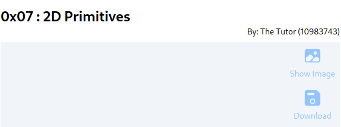

# UCS505 Lab Project
(Jan 2024)

**Update: 23 Apr 2024:** [Deadline Relaxed.](#0x08--documentation-and-presentation)

**Update: 8 Apr 2024:** [Project Announced.](#0x08--animations-project)

**Update: 2 Apr 2024**

After careful consideration to be in sync with the
other groups' workload, your assignments have been
restructured as follows:

**There will be only one project evaluated to 15 marks,
to be submitted in groups of 2 or 3 students as a
mandatory requirement.**

Hence, [the earlier list of
assignments](./README.orig.md) are **null and void**


# 0x08 : Animations (Project) #

[Starter
Template](https://github.com/tiet-ucs505/0x08-2d-animation-project)
| [Storyboard Submission Form](https://docs.google.com/forms/d/e/1FAIpQLSed6kxNCwgWZhej7wNamH5KpcSx03WXtDFQN0u1yLY7AaQ5sQ/viewform?usp=pp_url&entry.1189318782=3CO6&entry.294246879=109538745%3A%20Title%20Cased%20Name%0A109538457%3A%20Another%20Name%0A109538547%3A%20One%20More%20Name&entry.117129202=The+Punjab+Kings&entry.1197422271=https://github.com/pbks0000/0x08) | [Final Submission Form](https://docs.google.com/forms/d/e/1FAIpQLSfqPOC6JAZbnGd6d7kflzy94OFvDiBj654cON969e5US9b0zg/viewform?usp=pp_url&entry.1189318782=3CO6&entry.294246879=109538745%3A%20Title%20Cased%20Name%0A109538457%3A%20Another%20Name%0A109538547%3A%20One%20More%20Name&entry.117129202=The+Punjab+Kings&entry.1197422271=https://github.com/pbks0000/0x08)

|                                |                           |
|--------------------------------|---------------------------|
| Assignment Code                | 0x08                      |
| Storyboard Submission Opens    | Mon 08 Apr 2024 17:00 hrs |
| Storyboard Submission Deadline | Wed 10 Apr 2024 20:00 hrs |
| Final Submission Opens         | Wed 10 Apr 2024 17:00 hrs |
| Final Deadline                 | Mon 22 Apr 2024 08:00 hrs |
| Weightage                      | 15 marks                  |


## Assignment ##

Create an interactive/animated graphic sequence (or a
perpetual motion sequence) and invoke it within the
`run()` function of `experiment.js`.  This is a
creative-technical exercise, with a third of weightage
to design/creativity.

The submission shall be in two steps, namely
"Storyboard" and "Final" submissions.  The late
submissions shall attract a penalty of marks as per
protocol.

### Step 1: Storyboard ###

[What is a
storyboard?](https://www.google.com/search?hl=en&q=what%20is%20storyboarding#ip=1)

It is an industry standard practice to create a rough
sketch of target outcome of an animation through a few
key-frames sketched on a piece of paper like a comic
strip; so as to [fail earlier than
later](https://hbr.org/2011/04/failing-by-design).

Create a storyboard of your target animation sequence
(or a [perpetual
motion](https://www.google.com/search?q=perpetual+motion))
as you please.  This'll be your pitch to be submitted
on the storyboard submission deadline.

### Step 2: Animation ###

Using the [`requestAnimationFrame`
interface](https://developer.mozilla.org/en-US/docs/Web/API/window/requestAnimationFrame) 

Create an animation of a composition of 2D (or 3D)
geometry, its tranforms and /or its render styles.

As a project this gets submitted on the second
deadline.

## Using This Codebase ##

+ Fork this repository, and clone it to your workspace.
+ **Update your identity**: Modify your name and
  roll number on `experiment.js`, *eg.*

  ```javascript
  class Experiment {
    // Candidate Details
    static rollNo = '10983437,10983743'
    static name = 'The Tutors(Akhtar Banga, Phul Tekchand)'

    // ...
  }
  ```
  And it shall reflect on the top right of your page
  like:
  
  
+ **To save the canvas**: The top right of the canvas
  is overlaid with a download button for quick capture
  of the canvas.  This is better than Canvas >
  Right-click > "Save to image..." in that the filename
  contains roll number and submission code by default.

### Inside the `run` function ###

+ The canvas selector is available as `this.canvasSel`;
  and the canvas `DOM Node` may be retrieved as,
  
  ```javascript
  const canvas = document.querySelector(this.canvasSel)
  ```
+ There's a helper function `getCanvas` that can
  retrieve for you three useful details,
  + `DOM Node` of canvas;
  + 2D context of the canvas; and 
  + Bounding box details of the canvas as follows,
  
  ```javascript
  const {canvas, ctx, bb} = getCanvas(this.canvasSel)
  ```

## Deliverables ##

### Storyboard ###

1. Git URL
2. Commit ID
3. Storyboard (One image containing the storyboard)

### Final Project ###

1. Git URL
2. Commit ID
3. Storyboard (One image containing the storyboard)
3. Teaser
4. Video Link

## Evaluation Criteria ##

+ *5 mark*: Storyboard : Clarity on what to do, how
  much may be achieved, and creativity;
+ *5 mark*: Implementation of Render Engine;
+ *5 mark*: USP, eg. creativity, interactivity,
  novelty, originality etc.

## Logistic protocol and suggestions ##
+ The assignment shall be written **only** in
  HTML/CSS/Javascript.
+ A submission is admissible **only** using a
  `thapar.edu` account.
+ Candidates **are encouraged** to sensibly use
  external resources and duly acknowledge them using
  citations, *e.g.*  geometry definitions for a
  tranformation exercise.  Failure to cite an external
  resource shall be tantamount to plagiarism.
+ The deadlines are soft in the sense, that a delayed
  submission is admissible, albeit with **a penalty**
  of 30% rounded away from zero. *E.g.* 30% of a 5 mark
  submission is rounded away to 2 marks, and 30% of 10
  marks is rounded away to 4.
+ Any unethical practices (like plagiarism etc.)
  **shall be taken seriously**.

# 0x08 : Documentation and Presentation
[2024-04-23 Tue]

Dear All,

Congratulations on the successful submission of your
project!  I am able to witness that in general, you
have been able to grasp the fundamentals of graphics,
and especially, the character of visual appeal in
static spatial domain as well as the spatio-temporal
domain.

I, however, believe that there’s a scope of improvement
in terms of presentation, documentation and demo of
your project. Hence, a new component of 5-mark for
project documentation, and another 5-mark for
presentation (viva) has been added so that the project
will be evaluated out of 25 marks, but will be scaled
eventually, to 15-marks of lab evaluation.

For *documentation*, you shall create a **live** “Project
Page”, most easily done on [Github Pages](https://pages.github.com/), [Google Sites](https://support.google.com/a/users/answer/9310491?hl=en),
[Netlify](https://www.netlify.com/), [Wordpress](https://wordpress.com/) and so forth.  I would suggest that
you have an online profile on XXX.github.io (or alike),
and your “Project Page” be
XXX.github.io/YOUR-PROJECT-NAME.html .  The “Project
Page” shall link to a **live** “Working Demo”, say
something like
XXX.github.io/demos/YOUR-PROJECT-NAME/index.html.

The *documentation* shall include the list of
resources, assets, sources of inspiration etc. that you
have used; a brief note on each of your objective,
challenges, how you overcame them, and a link to the
working demo.  That is, follow [the STAR method](https://www.google.com/search?hl=en&q=the%20STAR%20method) for
reporting.

The deadline for your submission is May 2 08:00 am.  A
link to submission form shall follow.

For *presentation*, you shall be give a 7-min window to
present yourself: 3-4 mins for presentation and the
same for cross-examination.  Here’s a list of tentative
questions in the mind of an examiner, and suggested
time frame.

-   Ease in (30 seconds)
-   Overview (45 seconds)
-   The Architecture: Static Graphics – Challenges (1
    min)
-   The Architecture: Graphic Animations – Strategy (1
    min)
-   Conclude (30 seconds)

I am trying to rope in one or two external examiners
for evaluation.

The presentation shall tentatively be during 6-8 May
within your lab sessions. The details shall follow.

Additionally, you may also improve upon your submission
during this period, fit into the project template,
handle responsiveness, iron out the details etc.
Furthermore, you may also submit a different project
instead, under exceptional circumstances, and with
explicit permission of your lab instructor.

Hope that it’s an acceptable relaxation.

All the best,   
Raghav.

