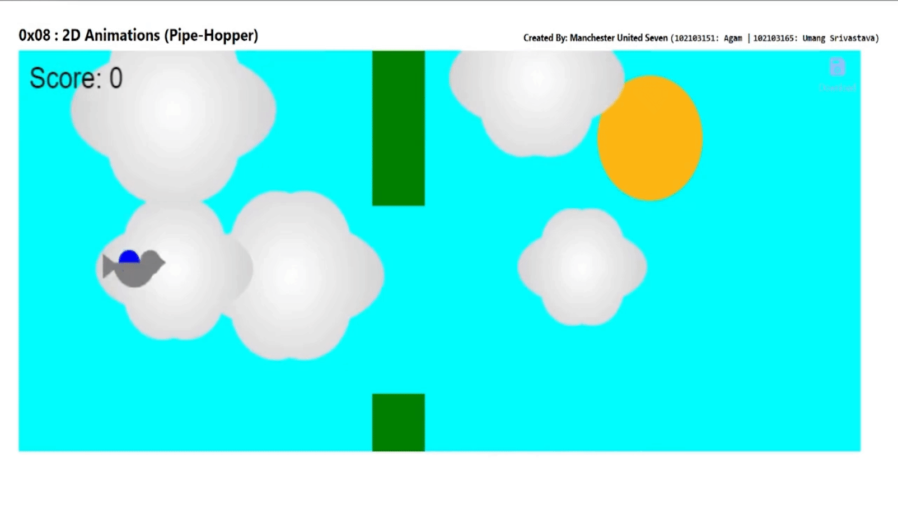

# Pipe Hopper

## Overview
**Created by:** Manchester United Seven (102103151: Agam | 102103165: Umang Srivastava)

The aim of this project is to create an interactive game in which your mission is to navigate bird through a series of obstacles, all while maintaining a delicate balance between gravity and flight. Get ready to flap those wings, dodge pipes, and aim for the sky! Because sometimes, all you need is a little bird with big dreams to remind you that the sky’s the limit.

## The Storyboard

## Project GIF

## Project in Detail

**Static Parts:** 
The static parts of the animation include:
- The sun.

**Dynamic Parts:** 
The dynamic parts of the animation include:
- Pipe
- Moving Bird
- Movement of clouds 

**Rationale:**
- Engagement: The static elements set the stage for the 
interaction, while the dynamic parts create engagement 
by allowing the user to participate actively in the animation.
- The dynamic nature provides immediate feedback
to the user's actions, enhancing the interactive experience.
- Reward System: The score serves as a 
reward for dodging the pipes and encouraging gamers to 
maintain a delicate balance between gravity and flight of bird.

**Story and Problem Solving:**
The game simulates the challenges faced by a small bird navigating through a series of obstacles. The player’s task is to keep the bird airborne by tapping the spacebar or mouse click, avoiding collisions with pipes, and aiming for the highest score. The game should strike a balance between simplicity and precision.

Challenges faced include:
- Bird Shape: Designing a bird sprite that feels natural, visually appealing, and responsive.
- Challenge: Creating dynamic cloud movement that adds depth to the game.

**Solution to above challenges:**
- Bird: We studied cartoon drawings of birds and tried to mimic the general idea, using semi circles for the body and wings, and manually adjusting distances to a create realistic bird sprite.
- Cloud: We tried to make an ellipse initially, but it looked very plain, so we adjusted by putting equal sized circles along the perimeter of the ellipse, to give it a rough cloud figure. We tried many values for the number of equidistant circles, but ended on 6, as it seemed the best.

## Demo ##

Link to [Working Demo](./Pipe-hopper(code))

## Roles ##

**Agam** 
- Storyboard Design
- Home Page
- Created Documentation Website
- Drew static elements(sun) 
- Added Funcitonalities(Pipe color changing,Cloud movement)

**Umang Srivastava**: 
- Bird and Cloud shape logic
- Maintain Functionalities (Bird flying, Clouds movement) 
- Added Funcitonalities(Score updation)

## Websites/Video's for reference ##
- [ChatGPT by OpenAI](https://chatgpt.com/)
- [How to use eventlistener events](https://www.freecodecamp.org/news/javascript-addeventlistener-example-code/)

## Objectives and Learnings ##
- Create assets such as bird,clouds for the game.
- Research online resources and gather inspiration.
- Implement keyboard or touch controls for the bird’s movement.
- Utilizing HTML5 canvas for interactive graphics, encompassing shape rendering and event responsiveness.
- Creating smooth animations using requestAnimationFrame and updating canvas elements dynamically.
